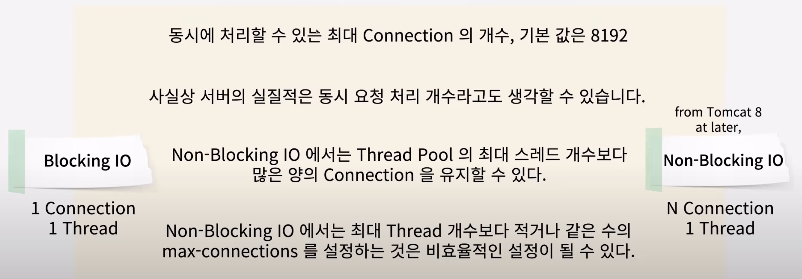

# Dispatcher Servelt (2)

### 논의 -1 ( 톰캣과 멀티 쓰레드 )

[1분 개발터뷰 | 대용량 트래픽을 처리하는 방법](https://www.youtube.com/shorts/JT1Bea43mCc)

- 톰캣은 내부적으로 쓰레드 풀을 200개(Default) 가지고 있다. 보통 쓰레드는 비용적 측면에 있어 소모가 심한 편인데 왜 톰캣은 이러한 쓰레드를 사용하는가?
    - 톰캣의 동작 방식에 의하면 사용자의 요청 1개당 1개의 쓰레드를 할당하는 (Thread Per Request) 방식이다.  단일 쓰레드 방식일 경우 사용자의 요청이 DB 접근과 같은 Blocking I/O 작업을 수행한다면 결과가 반환댈 때까지 다른 작업을 수행하지 못하기 때문에 멀티 쓰레드 방식을 사용한다.
    - (다수의 사용자 처리)
- 그렇다고 무한정 톰캣의 쓰레드 개수를 늘릴수는 없지 않을까>>>????
    - **Spring 3.2 에서는 Servlet 3.0, Servlet 3.1 에서 추가된 비동기, 논블로킹에 대한 기술을 편하게 활용할 수 있도록 Controller 의 Handler 가 다양한 자료형의 객체를 반환할 수 있도록 지원**
- Web 요청이 들어오면 Tomcat 의 Connector 가 Connection을 생성하면서 요청된 작업을 Thread Pool의 Thread에 연결한다,.

- 최신 버전의 톰캣을 사용중이라면 항상 Non-Blocking IO 방식을 사용중이다.

### 결론

<aside>
📖 스프링은 대형 서버 프로그램 지원해야 하기 때문에 자원의 효율적 이용과 동시 사용자 처리를 위해서 멀티 쓰레드 방식을 채택했다.

</aside>

- 자원의 효율적 이용 → 동시 사용자 처리

### 논의 -2

- Spring Bean은 어떻게 관리되는가? 여러 개의 톰캣 인스턴스가 쓰레드 별로 생성되고 관리되는데, 톰캣 인스턴스와 Spring Bean의 연관관계는 어떻게 되는가?

→ 톰캣 인스턴스와 Spring Bean의 연관관계

### 배경 지식

- Spring Bean은 IOC 컨테이너에 의해 싱글톤 패턴으로 관리된다. 언제나 동일한 오브젝트가 호출된다는 뜻이기 때문에  NO Thread-Safe.
- 고로 Bean 내부적으로 필드값 즉 상태를 유지하지 않도록 Stateless 해야 한다.
- 톰캣(WAS) : Request Per Thread → Servlet Context 를 가진다.
-

요청에 대한 쓰레드들은 싱글톤 패턴의 Spring Bean을 공유하여 사용한다.

> Tomcat의 Instance는 각각  Acceptor Thread 한 개가 있고, Dedicated Thread Pool을 보유하고 있다. 상태가 없는 객체를 공유하기 때문에 별도의 동기화 과정은 필요하지 않다. 따라서 컨트롤러가 수십회건 수만회건 요청을 받아도 문제가 생기지 않는다.
>

### 논의 -3

- 서블릿 처리 방식

→ 서블릿은 왜 Request - Per - Thread 일까? , Connection - Per - Thread가 아닌 이유 ?

-

T*hread-per-request를 쓰면 request가 진행될 때만 쓰레드가 개입을 하니까, 서비스는 수만명이 사용한다고 하더라도 현재 사용중인 요청에만 쓰레드를 투입시키면 되니까*

- Servlet Context는 Spring Bean에 접근하려면 Application Context를 참조해야 한다. **ApplicationContext도 ServletContainer에 단 한 번만 초기화되는 Servlet이다.**

→ 정적인 데이터 처리의 정의 ?

- 사용자 별로 다른 처리를 하지 못한다

### DispatcherServlet 의 Handler Mapping 방식

- BeanNameUrlHandlerMapping
- ControllerClassNameHandlerMapping
- SimpleUrlHandlerMapping
- DefaultAnnotationHandlerMapping

### BeanNameUrlHandlerMapping

- URL과 일치하는 이름을 갖는 빈의 이름을 Controller로 매핑하는 것

### ControllerClassNameHandlerMapping

- URL과 일치하는 클래스 이름을 갖는 빈을 Controller로 사용하는 방법

### SimpleUrlHandlerMapping

- URL 패턴에 매핑되는 지정된 Controller 를 사용하는 방법
- 하나의 컨트롤러에 여러 개의 URL 을 매핑하는 방법

### DefaultAnnonationHandlerMapping

- Annotation을 이용하여 url과 controller를 매핑하는 방법
- DispatcherServlet에 기본적으로 등록되어 있다.

→ 였지만 ….

> **Deprecated.**
>
>
> as of Spring 3.2, in favor of `[RequestMappingHandlerMapping](https://docs.spring.io/spring-framework/docs/4.3.7.RELEASE_to_4.3.8.RELEASE/Spring%20Framework%204.3.8.RELEASE/org/springframework/web/servlet/mvc/method/annotation/RequestMappingHandlerMapping.html)`
>

### RequestMappingHandlerMapping

1. RequestMappingHandlermappig 빈 생성
2. 빈 초기화 하면서 initHandlerMethods 호출
3. 빈 팩토리에 등록되어 있는 빈들 중 `@Controller` 또는 `@RequestMapping` 를 가지고 있는 빈을 가져온다
4. 핸들러가 될 수 있는 모든 메서드를 추출
5. 추출된 메서드를 registry 에 등록
